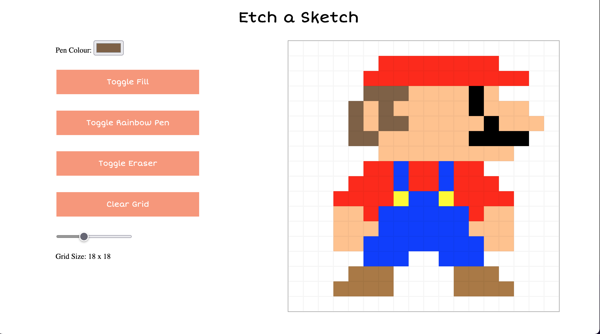

# Etch-A-Sketch-

My attempt at creating something similiar to the classic Etch-A-Sketch toy, using only HTML, CSS and vanilla Javascript.

Try it youreself Here https://effenp.github.io/Etch-A-Sketch-/

# Future Ideas:

to improve this project in the future i would like to add several features.

- buttons to add shading and highlights to a cell
- ability to save an image 

